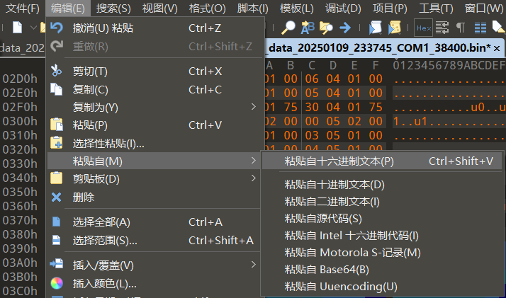
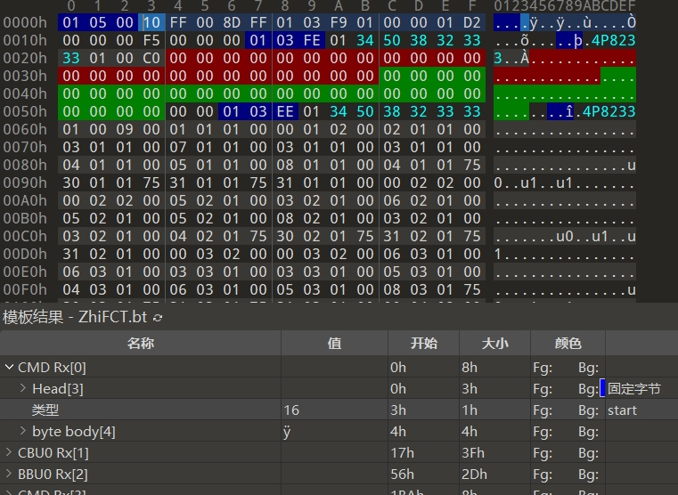
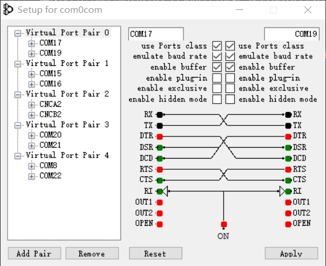

# SerialReplayer
 Record & Replay Serial Port Data

这是一个可以录制串口数据并重新发送串口数据的Python脚本**模板**，用于快速调试其他软件或硬件的串口功能。  
内含两个脚本，顾名思义，`record serial data.py`即记录一个串口发送的数据到文件，`replay serial data.py`即读取文件内的数据并重新发送到多个串口。  
暂时脚本仅记录了rx数据，没有做交互功能因此无法多次发送tx数据，所以也就没有录制tx数据。  
程序定义串口数据以逗号分割的csv格式进行保存，每行数据分两栏，第一栏为收到数据的时间，以第一次收到数据为0开始计时，第二栏为收到的数据，使用带空格分割的16进制字符串进行保存。函数有超时时间参数，当相邻两次收到数据的间隔时间超时后，插入新行。由于记录了时间，可以按照原有时间（或者重新编辑时间）发送指定数据。  
同时也以bin格式保存了rx数据，可以通过编写010 editor模板来对rx数据进行更为直观的自动解析。  

010 editor模板功能非常强大，即使没有使用本仓库的记录功能，而是使用了其他串口调试工具，也强烈建议用他对十六进制数据进行解析。

建议配合[com0com](https://sourceforge.net/projects/com0com/)等虚拟串口软件使用。虚拟串口软件可以添加若干对，每对串口的rx和tx是交叉的，这样就可以通过脚本记录或者模拟发送真实软硬件的串口数据了。个人建议每对串口按照下图设置。

必须强调目前这只是一个模板，而不是通用性的程序——因为目前我甚至还没有想明白这样的工作到底用什么样的操作方式能够兼顾灵活和易用。另外我知道目前有一些的虚拟modbus软件或者硬件，但是还没有见到实现本项目功能的软件。如果你有这方面的经验，希望可以分享交流下。    